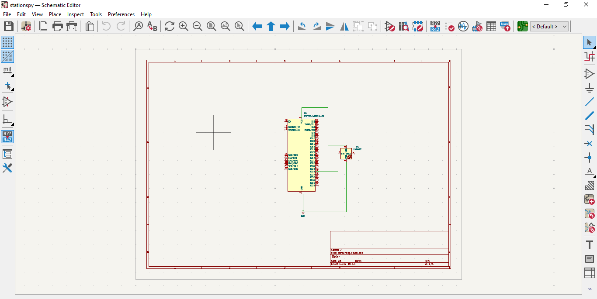
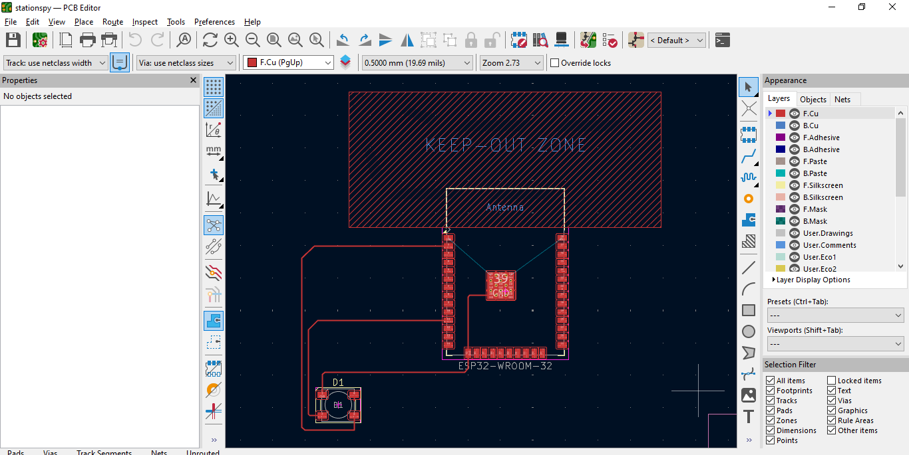

# Spy of Universe 🛰️

Hey! This is my project for the Hack Club Stardance challenge. I built a custom PCB that acts as a live space satellite tracker. When the International Space Station or another satellite flies directly over my house, the board jumps online and flashes a smart LED to let me know!

---

## 📸 What it Looks Like

### 1. My Circuit Schematic Diagram
Here is how I wired up the connections for the ESP32 chip and the smart pixel:

### 2. My Completed PCB Board Layout
Here is the final 2-layer routing lines after fixing all the layout errors. It passes the DRC check with 0 errors!

---

## 🛠️ The Hardware Parts I Used
* **Brain:** An ESP32-WROOM-32E module (this has the built-in Wi-Fi radio).
* **Light:** A single addressable SK6812 RGB Smart LED.
* **Wiring:** I routed the main data line signal out of Pin 11 (GPIO23) straight into the data input pin on the LED.

---

## 🤦‍♀️ My Mistakes & How I Fixed Them (The Dev Log)
Building this was a wild ride and I made a bunch of mistakes along the way, but I learned a ton fixing them:

* **The Antenna Zone Disaster:** In my first design, I ran copper circuit traces right through the crosshatched region underneath the ESP32 antenna. I didn't know this would completely ruin the Wi-Fi signal! I had to go back, clear the traces out, and leave the keep-out zone completely blank so my board can actually connect to the space network.
* **The Short-Circuit Scare:** I originally routed a copper track right through the middle of the pad for Pin 1, which created a massive short circuit risk. I had to rip up that track and re-route it safely around the outside of the pad to protect the board from frying.
* **The 7.69 GB Git Bash Loop:** When trying to push my updates via Git Bash, my terminal completely locked up and started an endless download loop. It wound up filling my laptop with 76,530 corrupted background items totaling 7.69 GB! I had to manually hunt down the hidden `staging` folder in Windows AppData, wipe the junk out completely, and move over to the web browser upload method to save the project.
* **The Missing Drill Files:** I successfully exported all my Gerber files but completely forgot to generate the `.drl` files. The factory wouldn't have known where to drill the holes for my ESP32 pins! I went back into KiCad's fabrication tool, clicked "Generate Drill Files," and uploaded the missing NPTH and PTH data sheets.

---

## 🚀 How the Software Works
Since I don't have home Wi-Fi, the ESP32 firmware is set up to automatically connect to my phone's mobile hotspot instead. Once it jumps online, it pings the live OpenNotify tracking network API over the internet. When the math shows a satellite crossing over my coordinates, it commands the LED to glow a bright cyan-blue color.

## 📂 Where Everything Is
* `/PCB` - My core KiCad design project files.
* `/firmware` - The clean tracking script I verified inside the Arduino IDE.
* `/production` - All the Gerber layer blueprints and drill files ready to print at the factory.
* `/CAD` - The 3D placeholder layout text.
* `bom.csv` - The exact component tracking spreadsheet listing.
*
